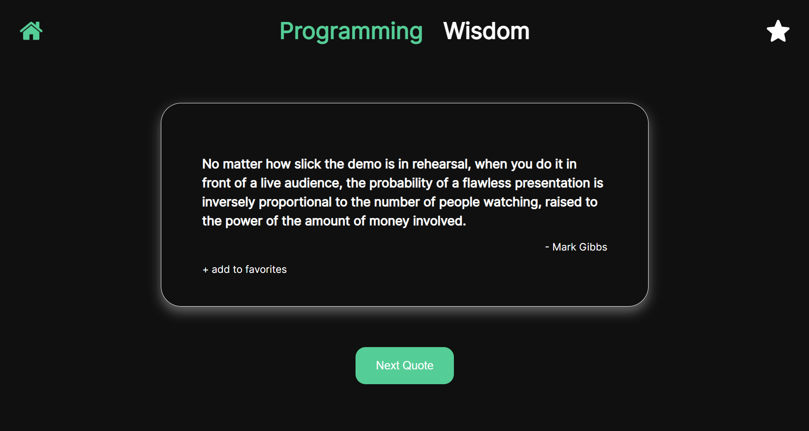

# Quote-Base
This VueJs application displays random quotes on the home page. On the home page the user can choose between two types of quotes: programming and wisdom oriented. The programming quotes are fetched from a <a href="http://quotes.stormconsultancy.co.uk/random.json" target="_blank">public API</a> one at a time. The wisdom quotes are fetched from a <a href="https://type.fit/api/quotes" target="_blank">public API</a> with around 1600 entries, from which one wisdom quote is selected and displayed. The fetching of results from both API's is done with axios.

While viewing a type of quote, a user can add the displayed code to their favorites. Users can add as many quotes as to their favorites while the application makes sure no duplicates are added. The favorite quotes are stored in the session storage.

Next the user can navigate to the favorites page. This is done either by direct url path /favorites or by clicking the star icon at the right top the application. Once on the favorites page, the user can view their saved favorites. For each quote displayed on the favorites page the user can chose to delete the selected quote from their favorites. The quote is then removed from the session storage.

The user can then navigate back to the home page by either providing the url path / or clicking the home icon at the left top of the application.

Lastly, the application is completely responsive and ready for each screen resolution, including a mobile navigation menu for selecting the different quote types.

Enjoy reading the quotes!



- <a href="#project-setup">Project Setup</a>
    - <a href="#installing">Installing</a>
    - <a href="#development">Development</a>
    - <a href="#production">Production</a>
    - <a href="#lint">Code corrections</a>
    - <a href="#tests">Running tests</a>
      
- <a href="#features">Features</a>
- <a href="#qa">Quality Assurance</a>


## <span id="project-setup">Project setup</span>

**requirements:**
- node 14.17.0

### <span id="installing">Installing</span>
```  
npm install  
```  

### <span id="development">Compiles and hot-reloads for development </span>
```  
npm run serve  
```  

### <span id="production">Compiles and minifies for production  </span>
```  
npm run build  
```  

### <span id="lint">Lints and fixes files  </span>
```  
npm run lint  
```  

### <span id="tests">Runs the tests  </span>
```  
npm run test:unit  
```  

## <span id="features">Features</span>

below all the features are listed for clarity. The application:

- displays random programming quotes,
- displays random wisdom quotes,
- allows the user to get new quotes with the click of a button
- has a dedicated page for displaying the users favorite quotes,
- enables the user to add quotes as their favorites,
- enables the user to remove quotes from their favorites,
- is mobile responsive and ready for each screen size,
- shows either a desktop navigation or mobile navigation depending on the screen size


## <span id="qa">Quality Assurance</span>

Due to limitations in time and skills only one components has been tested. It is stated though, that almost all possible aspects of this component are tested, including the mockup of the session storage. The test can be found in the test folder.
